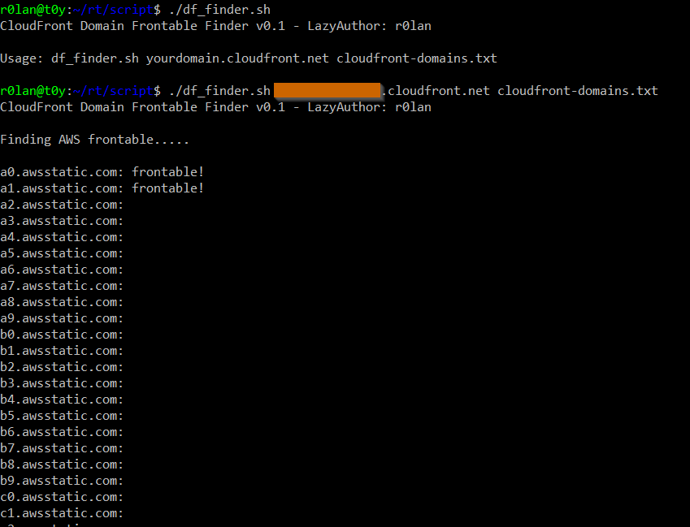
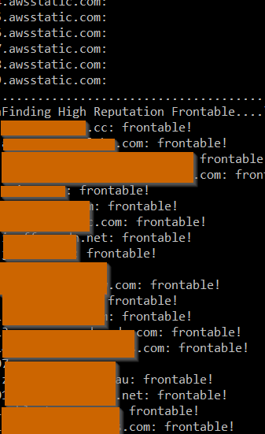

# Lazy-RedTeamer-Scripts

a collection of red teaming related scripts developed for lazy RedTeamer like me :)

(Disclaimer: All Sample Output are from personal lab environment. No real engagement information are not listed ¯\_(ツ)_/¯ )

## [CloudFront Domain Frontable Finder](df_finder.sh)

<i> Kudos to Vincent Yiu @vysecurity for his research https://www.mdsec.co.uk/2017/02/domain-fronting-via-cloudfront-alternate-domains/ and Cloudfront domain list, download here https://github.com/vysec/DomainFrontingLists <i>

## Pictures

  

  

## [Aggressor Auto Peristence for Low Priv](low_persis.cna)

Features
- Automatically create peristence for low privilege once initial beacon started.
- Upload to public folder
- Brab timestamp values from windows binary.

